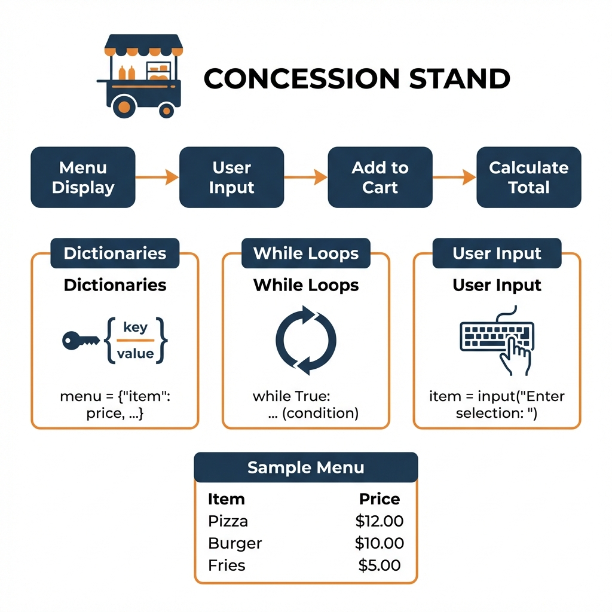

# Concession Stand

A Python terminal application for managing food orders at a concession stand.



## Features

- Interactive menu display with prices in Rands (R)
- Add items to cart by name
- Automatic order total calculation
- Simple command-line interface

## Menu Items

| Item   | Price   |
|--------|---------|
| Pizza  | R3.00   |
| Burger | R2.50   |
| Fries  | R1.50   |
| Kota   | R17.00  |
| Pap    | R10.00  |

## Usage

```bash
python concession_stand.py
```

Enter item names to add to cart. Type `q` to checkout.

## Concepts Demonstrated

- Python dictionaries
- While loops
- User input handling
- String formatting

## Sample Output

```
----Food Menu----
pizza     : R3.00
burger    : R2.50
fries     : R1.50
kota      : R17.00
pap       : R10.00
-----------------
Enter food item to add to cart (or q to finish): pizza
Enter food item to add to cart (or q to finish): fries
Enter food item to add to cart (or q to finish): q

--------Your Order--------
pizza: R3.00
fries: R1.50

Total: R4.50
```
